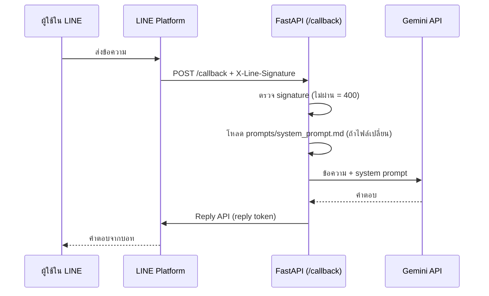

# LINE OA Gemini AI Chatbot

แชทบอทภาษาไทยสำหรับ LINE Official Account (LINE OA) ใช้ Google Gemini ตอบคำถามลูกค้า และรันบน FastAPI

โปรเจกต์นี้สร้างขึ้นเป็นผลงานตัวอย่างการพัฒนาแชทบอทและการประยุกต์ใช้ AI สำหรับเสนองานบนแพลตฟอร์มฟรีแลนซ์

---

## ฟีเจอร์หลัก (Key Features)

- **ตอบภาษาไทยด้วย Gemini:** บุคลิกและน้ำเสียงของบอทกำหนดได้เองในไฟล์ prompt
- **FastAPI Backend:** เรียก Gemini ใน thread pool เพื่อไม่ให้การรอ AI บล็อกเซิร์ฟเวอร์
- **ตรวจ Webhook Signature:** ปฏิเสธคำขอที่ไม่ได้มาจาก LINE (HTTP 400) ด้วยการตรวจ `X-Line-Signature`
- **แก้ Prompt ได้โดยไม่ต้องรีสตาร์ท:** แก้ไฟล์ `prompts/system_prompt.md` แล้วข้อความถัดไปจะใช้ prompt ใหม่ทันที ถ้าไฟล์ว่างหรือหาย บอทใช้ prompt ล่าสุดที่ใช้ได้ต่อไป
- **จัดการความลับอย่างปลอดภัย:** Token และ API key อยู่ใน environment variables (`.env` ถูก ignore ใน git) และไม่บันทึกเนื้อหาข้อความของลูกค้าลง log
- **มี Test 17 ข้อ + CI:** ครอบคลุมการตรวจ signature, การตอบข้อความ, การรับมือเมื่อ Gemini หรือ LINE ล้มเหลว และ prompt reload

---

## สถาปัตยกรรม (Architecture)



ไฟล์หลัก

| ไฟล์ | หน้าที่ |
|---|---|
| `main.py` | FastAPI app, `/callback` webhook, เรียก Gemini, ตอบกลับผ่าน LINE |
| `prompt_loader.py` | โหลด system prompt จากไฟล์ และโหลดใหม่เมื่อไฟล์ถูกแก้ |
| `prompts/system_prompt.md` | บุคลิกและคำสั่งของบอท (แก้ได้เอง) |
| `tests/` | pytest: webhook, Gemini, prompt loader |
| `Dockerfile`, `.github/workflows/ci.yml` | container image และ CI |

---

## เทคโนโลยี (Tech Stack)

- **Python 3.10+** (ทดสอบบน 3.12)
- **FastAPI** + **Uvicorn**
- **line-bot-sdk>=3.5.0**
- **google-genai** (โมเดลเริ่มต้น `gemini-2.5-flash` เปลี่ยนได้ด้วย `GEMINI_MODEL`)
- **python-dotenv**, **pytest**, **Docker**, **GitHub Actions**

---

## การติดตั้งและรัน (Setup)

### 1. สร้างไฟล์ `.env`
```bash
copy .env.example .env
```
แล้วกรอกค่า

```env
LINE_CHANNEL_ACCESS_TOKEN=...
LINE_CHANNEL_SECRET=...
GEMINI_API_KEY=...
```

ค่าเสริม: `GEMINI_MODEL`, `SYSTEM_PROMPT_PATH`, `LOG_LEVEL`, `HOST`, `PORT`, `RELOAD=1` (รีโหลดโค้ดตอนพัฒนา)

### 2. รันเซิร์ฟเวอร์
บน Windows ใช้สคริปต์ได้เลย

```bash
run_chatbot.bat
```

หรือรันเอง

```bash
pip install -r requirements.txt
python main.py
```

### 3. เปิด Webhook ด้วย ngrok
LINE ต้องใช้ HTTPS

```bash
ngrok http 8080
```

นำลิงก์ที่ได้ไปใส่เป็น Webhook URL ใน LINE Developers ในรูปแบบ `https://<โดเมน>.ngrok-free.dev/callback` แล้วเปิด **Use webhook**

---

## ปรับแต่งบุคลิกบอท

แก้ `prompts/system_prompt.md` แล้วบันทึก ข้อความถัดไปที่ลูกค้าส่งมาจะใช้ prompt ใหม่ทันที ไม่ต้องรีสตาร์ท ใช้ตำแหน่งไฟล์อื่นได้ด้วย `SYSTEM_PROMPT_PATH`

---

## ทดสอบ (Tests)

```bash
pip install -r requirements-dev.txt
pytest
```

Test ใช้ credential จำลองและ mock ทั้ง Gemini กับ LINE จึงไม่เรียก API จริงและไม่ต้องมี key

---

## Docker

```bash
docker build -t line-ai-chatbot .
docker run --rm -p 8080:8080 --env-file .env line-ai-chatbot
```

---

## Deploy บน Google Cloud Run

deploy จริงแล้วที่ region `asia-southeast1`: https://line-ai-chatbot-618816656832.asia-southeast1.run.app/ (health check ตอบ `{"status":"running",...}`) ส่วน `/callback` ตอบเฉพาะคำขอที่มี signature ถูกต้องจาก LINE

เก็บความลับใน Secret Manager แล้วผูกเข้ากับ service (`--max-instances 2` จำกัดค่าใช้จ่ายและภาระ)

```bash
gcloud run deploy line-ai-chatbot \
  --source . \
  --region asia-southeast1 \
  --allow-unauthenticated \
  --max-instances 2 \
  --set-secrets LINE_CHANNEL_ACCESS_TOKEN=line-token:latest,LINE_CHANNEL_SECRET=line-secret:latest,GEMINI_API_KEY=gemini-key:latest
```

จากนั้นนำ URL ของ service + `/callback` ไปใส่เป็น Webhook URL ใน LINE Developers

---

## ข้อจำกัดและสิ่งที่จะทำต่อ (Limitations)

- บอทยังไม่จำบทสนทนา: ตอบทีละข้อความ ยังไม่มีประวัติรายผู้ใช้
- รองรับเฉพาะข้อความตัวอักษร ข้อความประเภทอื่น (สติกเกอร์, รูป) จะถูกข้าม
- ยังไม่มี rate limit ต่อผู้ใช้ และยังไม่มี evaluation คุณภาพคำตอบ
- ต่อไป: เก็บประวัติสนทนาในฐานข้อมูล, เพิ่ม rate limit, ชุดทดสอบคุณภาพคำตอบ

---

## ลิขสิทธิ์
โปรเจกต์นี้ใช้เพื่อการศึกษาและเป็นแนวทางการเขียนโค้ด
*(พัฒนาโดย: **Wish Nakthong**)*
